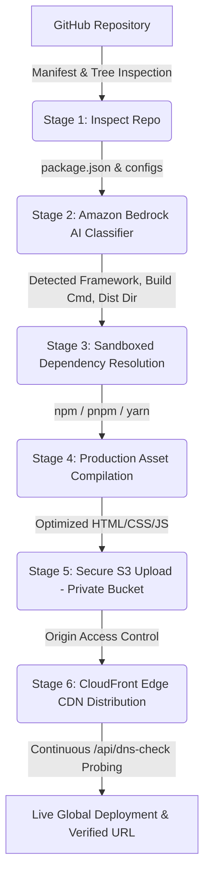

# ⚓ Anchor — Serverless AWS Deployment Engine

> **Vercel simplicity, powered directly by AWS.**  
> Transform any GitHub repository into a globally distributed, secure static web application on Amazon S3 + CloudFront Edge CDN in under 30 seconds with Amazon Bedrock generative framework detection and zero manual cloud configuration.

[](https://main.dnnu4lkh82cpn.amplifyapp.com/)
[](https://aws.amazon.com/)
[](https://nextjs.org/)
[](https://aws.amazon.com/bedrock/)
[](https://www.typescriptlang.org/)

---

## 🌟 Live Production Deployment
- **Live URL**: [https://main.dnnu4lkh82cpn.amplifyapp.com/](https://main.dnnu4lkh82cpn.amplifyapp.com/)
- **AWS Infrastructure**: Hosted on AWS Amplify (Compute Role + Service Role) in `us-east-1`.

---

## 💡 The Problem & Solution

| The Traditional AWS Challenge | The Third-Party PaaS Tax | The Anchor Advantage |
| :--- | :--- | :--- |
| Configuring S3, CloudFront, IAM roles, Origin Access Control (OAC), build pipelines, and Route53 DNS takes hours of manual Terraform/CDK scripting. | Fast and simple developer experience, but carries heavy bandwidth markups, proprietary lock-in, and opaque infrastructure. | **The best of both worlds**: 1-click developer experience that deploys directly into real AWS infrastructure with zero markup and 100% cloud ownership. |

---

## 🚀 Key Features

### 1. 🤖 AI Architecture Classifier (Amazon Bedrock)
- Inspects repository file trees and manifests (`package.json`, build configs) without requiring large git clone overhead.
- Invokes **Amazon Bedrock** (`anthropic.claude-3-haiku` / Amazon Nova) to automatically deduce the frontend framework (Vite, React, Svelte, Vue, Create-React-App, Astro, static HTML5 canvas games), dependencies, package managers (`npm`, `pnpm`, `yarn`), and the exact production build command and output directory (`dist/`, `build/`, `public/`).

### 2. ⚡ "Try It Live — No Sign-In Required"
- Test the real deployment engine instantly with 1-click access across 6 real open-source apps:
  - **2048 Puzzle Game** (`gabrielecirulli/2048`) — Canvas Game (13.4k ⭐)
  - **IsoCity Simulator** (`victorqribeiro/isocity`) — Isometric SimCity-style urban builder
  - **Classic Arcade Tetris** (`jakesgordon/javascript-tetris`) — Retro arcade puzzle game
  - **Vite + React SPA** (`SafdarJamal/vite-template-react`) — Modern component pipeline
  - **Svelte 4 App** (`sveltejs/template`) — Reactive Rollup bundle
  - **Developer Portfolio** (`asprooo/mon-portfolio`) — Responsive HTML5 showcase

### 3. 🔒 100% Private S3 + CloudFront Edge CDN (Origin Access Control)
- Provisions a dedicated, private Amazon S3 bucket with public access strictly blocked.
- Configures an **Amazon CloudFront Edge Distribution** connected to 600+ Points of Presence (PoPs) worldwide.
- Implements **Origin Access Control (OAC)**: Only CloudFront is cryptographically authorized to read static assets from the S3 bucket.

### 4. 🌐 Real-Time Edge DNS Probing & Resolution Check
- Tracks global edge DNS resolver propagation (~60–120s) with active HTTP/TLS server-side health checks via `/api/dns-check`.
- Eliminates premature browser `NXDOMAIN` errors by continuously verifying edge reachability before marking deployments as live.

### 5. 💰 Itemized AWS Cost Estimation Engine
- Transparently calculates exact monthly AWS infrastructure bills down to five decimal places:
  - **Amazon S3 Storage**: `$0.023 / GB-month`
  - **CloudFront Data Transfer**: `$0.085 / GB tier`
  - **CloudFront HTTPS Requests**: `$0.0075 / 10k requests`
  - **Average Cost**: `~$0.0003 / month` for standard low-traffic static sites ($0.00 base cost).

### 6. ✨ Production-Grade Developer Interface
- **Fluid WebGL Orb**: Interactive procedural GLSL shader visual accent in the hero section.
- **Interactive Developer Terminal**: Copy-pasteable cURL, GitHub Actions CI/CD, and CLI deployment commands.
- **Interactive Architecture Flow**: Visual 4-stage exploration of Bedrock, container sandboxing, S3 OAC, and CloudFront.
- **Operational Beacon**: Live real-time AWS `us-east-1` health badge.

---

## 🏗️ Architecture & 6-Stage Deployment Pipeline



### Pipeline Breakdown:
1. **Inspect Repository (GitHub API)**: Fetches repository metadata and manifests via GitHub REST API.
2. **Analyze Architecture (Amazon Bedrock)**: Generative AI classifies the stack and outputs deterministic build parameters.
3. **Install Dependencies**: Resolves packages in a sandboxed execution environment.
4. **Build Static Assets**: Executes production compilation script generating minified distribution assets.
5. **Upload to S3**: Streams compiled assets to an isolated, private AWS S3 bucket.
6. **Configure CloudFront CDN**: Configures CloudFront distribution with Origin Access Control (OAC) and default root object routing.
7. **Live Verification & DNS Probing**: Verifies edge listener propagation and displays the live HTTPS CloudFront URL.

---

## 🛠️ Technology Stack

| Layer | Technologies |
| :--- | :--- |
| **Frontend & Fullstack** | Next.js 15 (App Router), React 19, TypeScript, Tailwind CSS v4, Lucide Icons |
| **Generative AI** | Amazon Bedrock (`@aws-sdk/client-bedrock-runtime`, Nova / Claude 3 Haiku) |
| **AWS Infrastructure** | Amazon S3, Amazon CloudFront (OAC), Amazon DynamoDB, AWS IAM, AWS Amplify |
| **Authentication & APIs** | NextAuth.js (GitHub OAuth Provider), Octokit (GitHub REST API) |
| **Graphics & Animation** | Three.js, Custom WebGL GLSL fragment shaders (`fluid-orb`) |

---

## 📦 Getting Started & Local Setup

### Prerequisites
- Node.js 20+
- `pnpm` (or `npm` / `yarn`)
- AWS Account with Bedrock, S3, CloudFront, and DynamoDB permissions
- GitHub OAuth App (for authenticated dashboard)

### 1. Clone the Repository
```bash
git clone https://github.com/rishisingh1034/anchor.git
cd anchor
```

### 2. Install Dependencies
```bash
pnpm install
```

### 3. Configure Environment Variables
Create a `.env.local` file in the project root:

```env
# AWS Credentials & Configuration
AWS_REGION=us-east-1
AWS_ACCESS_KEY_ID=your_aws_access_key_id
AWS_SECRET_ACCESS_KEY=your_aws_secret_access_key
BEDROCK_MODEL_ID=amazon.nova-lite-v1:0
DEPLOYMENTS_TABLE=deployments
DEPLOY_BUCKET_PREFIX=anchor-site

# GitHub OAuth & NextAuth Configuration
GITHUB_CLIENT_ID=your_github_oauth_client_id
GITHUB_CLIENT_SECRET=your_github_oauth_client_secret
DEMO_GITHUB_TOKEN=your_github_personal_access_token
NEXTAUTH_SECRET=your_nextauth_secret_key
NEXTAUTH_URL=http://localhost:3000
```

### 4. Run Development Server
```bash
pnpm dev
```
Open [http://localhost:3000](http://localhost:3000) in your browser.

### 5. Build for Production
```bash
pnpm build
pnpm start
```

---

## 🛡️ Security & Origin Access Control (OAC)

Anchor enforces enterprise-grade AWS security defaults:
- **Zero Public S3 Buckets**: Public read access to S3 buckets is disabled (`BlockPublicAcls`, `IgnorePublicAcls`, `BlockPublicPolicy`, `RestrictPublicBuckets`).
- **Origin Access Control (OAC)**: S3 bucket policies grant `s3:GetObject` permission strictly to the CloudFront distribution's Service Principal (`cloudfront.amazonaws.com`) conditioned on the specific Distribution ARN.
- **TLS 1.3 & HTTPS Only**: CloudFront enforces HTTPS redirects and modern TLS cipher suites.

---

## 🗺️ Scope & Roadmap

### Current MVP Scope
- ✅ Single Page Applications (Vite, React, Vue, Svelte)
- ✅ Static HTML5 Canvas games & interactive simulations
- ✅ Static exports (Next.js static export, Astro, Gatsby)
- ✅ Real-time 6-stage SSE / polling deployment pipeline
- ✅ Anonymous 1-click live demo allow-list
- ✅ Real-time edge DNS resolver health checks

### Roadmap
- 🔄 Full-stack Server-Side Rendering (SSR) via Lambda@Edge / CloudFront Functions
- 🌐 Custom domain binding with automated ACM SSL certificates and Route53 records
- 🌿 Branch / Pull Request ephemeral preview environments
- 📊 Web analytics and edge log monitoring

---

## 📄 License
MIT License © 2026 [Anchor Contributors](https://github.com/rishisingh1034/anchor)
